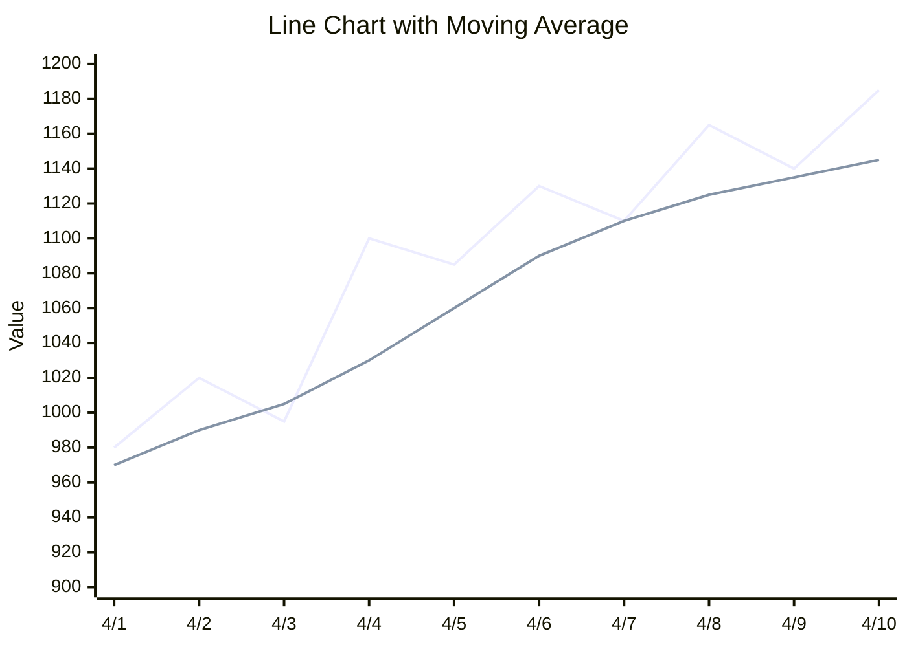

# Mermaid line chart sample

移動平均線つきの時系列折れ線グラフのサンプルです。

```mermaid
xychart-beta
    title "Line Chart with Moving Average"
    x-axis ["4/1", "4/2", "4/3", "4/4", "4/5", "4/6", "4/7", "4/8", "4/9", "4/10"]
    y-axis "Value" 900 --> 1200
    line [980, 1020, 995, 1100, 1085, 1130, 1110, 1165, 1140, 1185]
    line [970, 990, 1005, 1030, 1060, 1090, 1110, 1125, 1135, 1145]
```

## Notes

- 1本目の `line` が日々の値です。
- 2本目の `line` が移動平均線のイメージです。
- Mermaid の `xychart-beta` を使っています。
